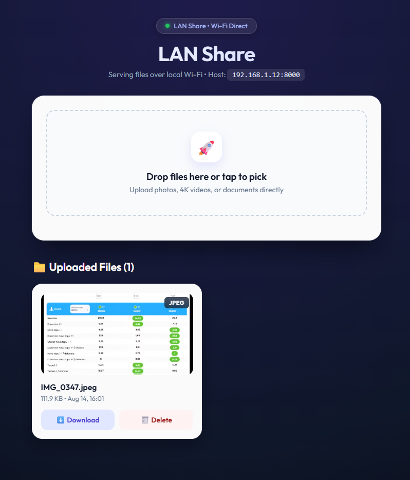

# 📷 LAN Share

> **Zero-Config, AirDrop-for-Everyone Peer-to-Peer LAN File Sharing System**

[](https://www.python.org/)
[](https://fastapi.tiangolo.com/)
[](https://www.uvicorn.org/)
[](LICENSE)

<p align="center">
  
</p>

**LAN Share** turns your laptop into a high-speed, secure local file sharing hub. Any device on the same Wi-Fi network (iOS, Android, Windows, Mac, Linux) can scan a QR code printed in your terminal, enter a 4-digit PIN, and instantly upload or download photos, 4K videos, and large documents without installing any app or trusting cloud services.

---

## ✨ Features

- 🔒 **4-Digit PIN Security Gate**: Generates a random 4-digit PIN on host startup and enforces cryptographically signed session cookies (`itsdangerous`) to block unauthorized devices on public Wi-Fi.
- ⚡ **1 MB Chunk Streaming**: Streams uploads in 1 MB chunks directly to disk. Peak RAM usage remains ~1 MB whether transferring a 5 KB text file or a 4 GB video.
- 🎨 **Modern Glassmorphism UI**: Beautiful, mobile-first responsive dashboard with drag-and-drop dropzone, live upload progress bars, extension badges (`PNG`, `JPG`, `MP4`, `PDF`), and lazy-loaded image thumbnails.
- 📱 **Cross-Platform & App-Less**: Zero client-side installation. Works on any browser via QR code scanning.
- 🛡️ **Defense-in-Depth Path Traversal Security**: Strict path sanitization (`resolve_upload_path`) prevents directory traversal attacks on uploads, downloads, and deletions.
- 📁 **Two-Way Sharing**: Upload files to the laptop OR download and delete existing files directly from any phone or tablet.

---

## Project Directory Structure

```

lan-share/
├── static/                # Frontend Assets
│   ├── style.css          # CSS styling
│   └── app.js             # Drag-and-drop & XHR Upload Progress JavaScript
├── templates/             # HTML Templates
│   ├── login.html         # 4-Digit PIN Unlock Screen HTML
│   └── index.html         # Main upload dropzone & live file gallery
├── lanshare.py            # FastAPI backend server, security & streaming logic
└── .gitignore             # Git tracking exclusion rules

```


---

## 🚀 Quick Start

### 1. Prerequisites & Installation

Ensure Python 3.9+ is installed, then install the required dependencies:

```bash
pip install fastapi uvicorn python-multipart qrcode rich itsdangerous jinja2
```

### 2. Running the Server

Start the server from the directory:

```bash
.\.venv\Scripts\python.exe .\lanshare.py
```

### 3. Connecting Your Devices

1. Look at your host terminal for the printed **4-Digit PIN** and **QR Code**.
2. Scan the QR code with your phone camera or open `http://<LAN-IP>:8000` in your browser.
3. Enter the 4-digit PIN to unlock the file gallery and upload dropzone.

---

## ⚙️ CLI Options & Flags

| Flag / Parameter | Default | Description |
| :--- | :--- | :--- |
| `target` | `~/lanshare` | Target directory where uploaded files are saved |
| `--port` | `8000` | Port number to run the Uvicorn web server |

### Examples

```bash
# Save uploaded files to ~/Downloads folder
python lanshare.py ~/Downloads

# Run server on custom port 9000
python lanshare.py ~/photos --port 9000
```

---

## 🛠️ Tech Stack

- **Backend Framework**: [FastAPI](https://fastapi.tiangolo.com/) + [Uvicorn](https://www.uvicorn.org/) (ASGI)
- **Security & Cookies**: [itsdangerous](https://itsdangerous.palletsprojects.com/) (Cryptographic URLSafeSerializer)
- **Terminal UI**: [Rich](https://github.com/Textualize/rich) + [qrcode](https://pypi.org/project/qrcode/) (Unicode ASCII rendering)
- **Frontend Architecture**: HTML5, Vanilla CSS3 (Glassmorphism), Vanilla JS (XHR Progress API)
- **Templating Engine**: [Jinja2](https://jinja.palletsprojects.com/)

---

## 📄 License

Distributed under the MIT License. See `LICENSE` for more information.
